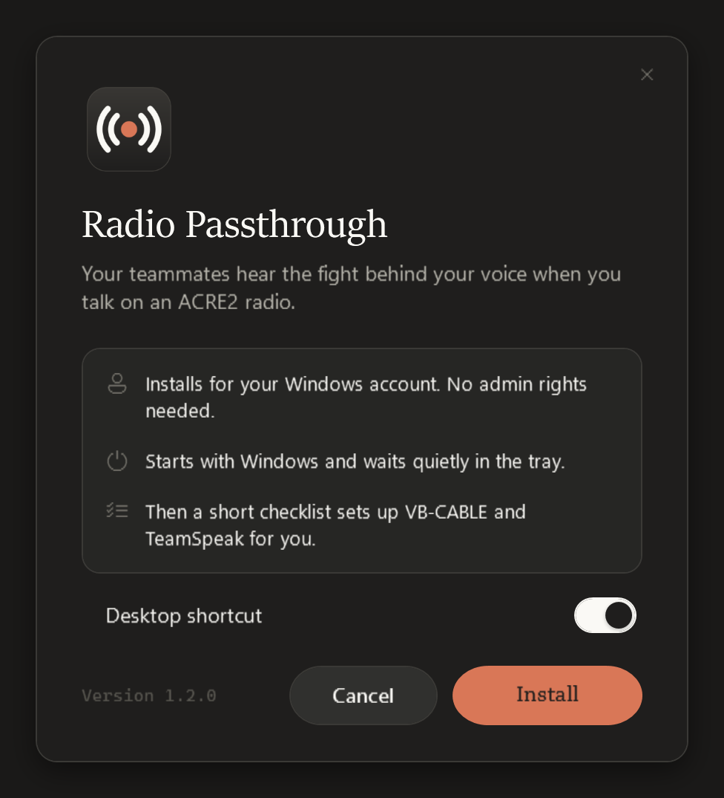
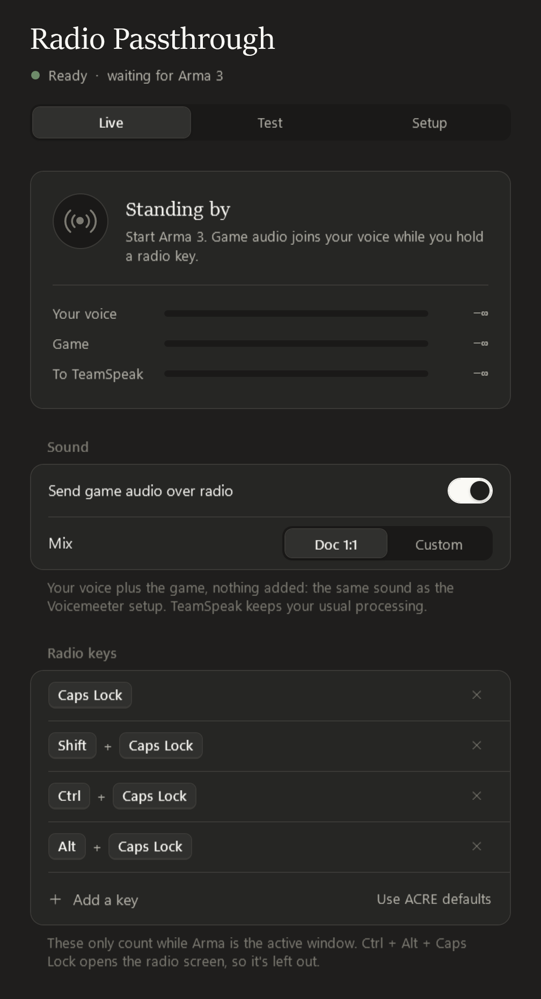
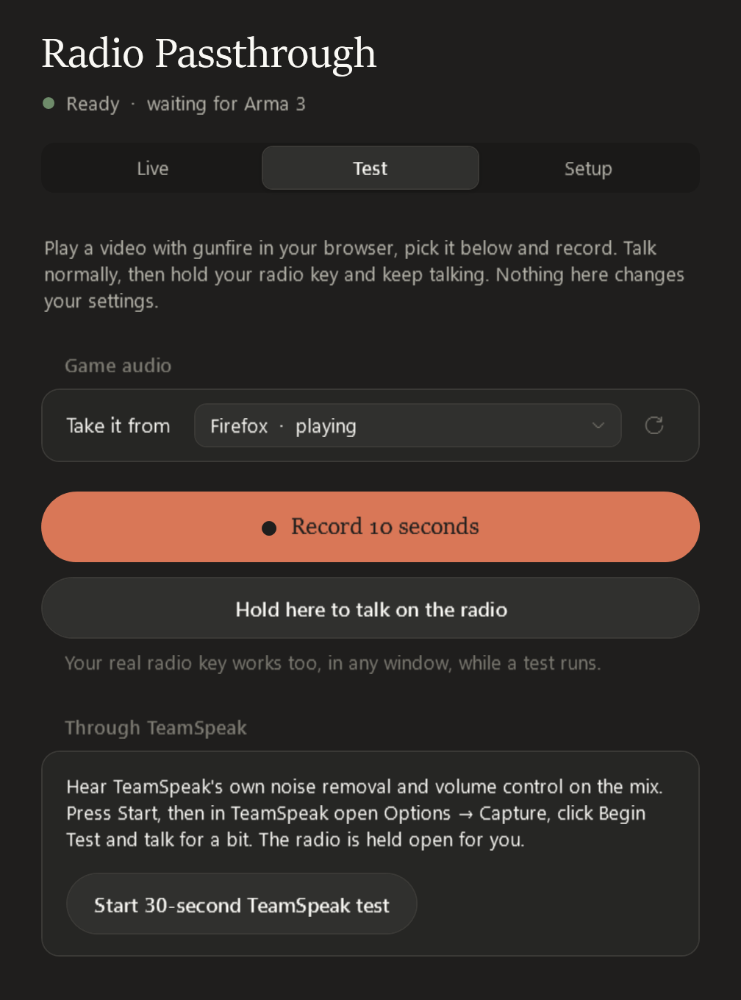

# Radio Passthrough

When you talk on an ACRE2 radio in Arma 3, your teammates hear the fight around you (gunfire, engines, explosions) behind your voice. It replaces the Voicemeeter + MacroButtons + AutoHotkey guide with one small app that sets itself up.

```
Your mic ─────────────────────────────┐
Arma 3's own sound ── radio key held ─┴─► mix ─► VB-CABLE ─► TeamSpeak's mic
```

- Direct speech stays voice only. Game sound is added **only while you hold a radio key** in Arma (ACRE2 defaults: Caps Lock, and Shift, Ctrl or Alt + Caps Lock).
- Your headset keeps playing Arma and TeamSpeak exactly as before. Nothing gets rerouted.
- The default **Doc 1:1** mix is plain voice plus game with nothing added. Your mic's background noise (fans, hum) is gated out between words so ACRE's radio effect doesn't turn it into hiss; game audio is never touched.
- **Radio Passthrough never connects to the internet.** It contains no networking code at all. See [What it does on your PC](#what-it-does-on-your-pc).

<p align="center">
  
  &nbsp;
  
  &nbsp;
  
</p>

**Requirements:** Windows 10 (version 2004 or newer) or Windows 11, 64-bit. Arma 3 with ACRE2, TeamSpeak 3, and [VB-CABLE](https://vb-audio.com/Cable/) (free; the app walks you through it).

## Install (about three minutes)

1. Download **RadioPassthrough-Setup-x.y.z.exe** from the Releases page and run it.
   - If Windows says *"Windows protected your PC"*, click **More info → Run anyway**. The file isn't code-signed yet; that's all the warning means. Every release is built by GitHub straight from this source, and you can [check your download](SECURITY.md#verifying-a-download).
2. Click **Install**. No admin rights needed. Radio Passthrough opens on its checklist.
3. Work down the checklist:
   - **VB-CABLE → Get VB-CABLE.** VB-Audio's official page opens. Download the *VB-CABLE Driver Pack*, unzip it, right-click `VBCABLE_Setup_x64.exe` → **Run as administrator** → **Install Driver**. The checklist turns green by itself. The app hides VB-CABLE's unused extra device and makes sure your own speakers and mic stay the Windows defaults.
   - **TeamSpeak microphone → Set up.** If TeamSpeak is open it closes for a moment and comes back.
4. Done. When the top line says **Ready**, join your server and use your radio as normal.

The app starts with Windows and sits in the tray (the radio-wave icon). Closing the window keeps it running. It has to be running for TeamSpeak to hear you.

## Check how you sound

On the **Test** tab:

1. Play a video with gunfire in your browser and pick it under *Take it from*.
2. Press **Record 10 seconds**. Talk, then hold your radio key (or *Hold here to talk on the radio*) and keep talking.
3. Play it back as **What TeamSpeak gets**, or as **What a teammate hears**. The second one uses TeamSpeak's Opus codec plus ACRE2's own radio filter, noise and distortion.

Nothing on the Test tab changes your settings.

## Everyday controls

- **Live tab:** see when you're on the radio and your levels. Switch *Send game audio over radio* off to go voice-only.
- **Background noise:** how far your mic is turned down between words (Off to −40 dB, default −30 dB), so fan and room noise doesn't turn into hiss on the radio. The mix itself is always Doc 1:1.
- **Radio keys:** add or remove keys (mouse side buttons work) if you changed ACRE's keybinds. With TFAR, add your TFAR radio keys. The mix works the same; only the Test tab's radio preview is ACRE-specific.
- **Tray menu:** open the app, switch game audio on or off, or quit.

## If something's wrong

| What happens | Try this |
|---|---|
| Nobody hears me at all | Is Radio Passthrough running (tray icon)? Open it and check the top line. |
| Teammates hear me but no game sound | Hold the radio key **in Arma** (it only counts while Arma is the active window). The Live tab should say *On the radio*. |
| Setup says Arma runs as administrator | Click **Restart as admin**, or stop running Arma as admin. |
| My speakers or mic switched to "CABLE" | The app switches them back by itself (Setup → *Keep my speakers and mic as the defaults*). |
| Game too loud or quiet on the radio | Change Arma's own volume, as with the Voicemeeter setup. Test it on the Test tab. |
| Teammates hear hiss behind my voice | Live → *Background noise*: move it further right. |
| My antivirus complains | Unsigned new files sometimes get flagged. [Check your download is the genuine build](SECURITY.md#verifying-a-download), or build it yourself from this source (below). |
| Still stuck | Setup → **Copy diagnostics**, then paste it where you ask for help. Your Windows user name is removed from it. |

## Uninstall

Go to **Settings → Apps → Radio Passthrough → Uninstall**. TeamSpeak goes back to your normal mic, the *Radio Passthrough* capture profile is removed, and the app, its settings and logs are deleted. VB-CABLE stays; remove it there too if you want.

## What it does on your PC

Everything the app reads or changes, so nothing is a surprise:

| What | Why |
|---|---|
| Records your microphone and **Arma 3's own sound** (Windows per-app audio capture) | To mix them. Nothing is recorded to disk except test clips you make on the Test tab, which stay in memory. |
| Reads whether your radio keys are held (only the keys you bound, plus Shift/Ctrl/Alt) | To know when you're on the radio. Keys are only checked while Arma is the active window. Nothing is stored or sent. |
| Plays the mix into VB-CABLE | That's what TeamSpeak uses as your mic. |
| Adds a "Radio Passthrough" capture profile to TeamSpeak's `settings.db` | So TeamSpeak uses the cable. It backs up the file first (last 5 kept) and only writes while TeamSpeak is closed. |
| Puts your own speakers and mic back as Windows defaults if they get switched to the cable, and hides VB-CABLE's unused extra device | So Windows, Discord and games never pick the cable. You can switch this off. |
| Installs to `%LOCALAPPDATA%\Programs\Radio Passthrough`, adds a Start menu entry and an Apps entry, and starts with Windows | Standard per-user install. No admin rights, no services, no drivers of its own. |
| Writes settings to `%APPDATA%\RadioPassthrough` and logs to `%LOCALAPPDATA%\RadioPassthrough\logs` (14 days) | Logs stay on your PC. |

It never injects anything into Arma or TeamSpeak, never touches the game's memory, never runs as a service, and never connects to the internet. The only web page it can open is VB-Audio's, and only when you click *Get VB-CABLE*.

## For developers

Requires the .NET 10 SDK on Windows.

```
dotnet test
powershell -ExecutionPolicy Bypass -File .\build.ps1      # → dist\RadioPassthrough-Setup-<version>.exe
```

- `src/RadioPassthrough.Core`: audio engine, mixer, ACRE2 effect, radio keys, TeamSpeak settings, installer, device guard.
- `src/RadioPassthrough`: WPF app (Live / Test / Setup, tray, installer window).
- `tests`: unit tests, plus device tests that only put tones into VB-CABLE. They skip themselves while TeamSpeak or the app is running.
- `RadioPassthrough.exe --snapshot <dir> [--theme light|dark]` renders every screen to PNG off-screen. `--portable` runs without installing.
- For admins: `RadioPassthrough-Setup-x.y.z.exe --install [--desktop-shortcut]` installs or updates without the installer window, then starts the app in the tray. Updates keep an existing desktop shortcut and the *Start with Windows* choice. `"%LOCALAPPDATA%\Programs\Radio Passthrough\RadioPassthrough.exe" --uninstall --quiet` removes it.
- `--selftest <file>` checks the parts that need real Windows (tray, SQLite, key reading, device guard, windows, no network code loaded) without showing or changing anything. `build.ps1` runs it on the finished file.
- Releases come only from GitHub: pushing a `v*` tag runs the tests, builds, self-tests, signs a build record and publishes the release (`.github/workflows/build.yml`). The tag must match `<Version>` in `RadioPassthrough.csproj`, and the release notes come from `CHANGELOG.md`.

## Code signing policy

Radio Passthrough has applied for free code signing from [SignPath.io](https://about.signpath.io), with a certificate by [SignPath Foundation](https://signpath.org). Until that's approved, releases are unsigned; you can still [check any download](SECURITY.md#verifying-a-download).

- Only files built by this repository's GitHub workflow from a `v*` tag are released (and, once approved, signed). Nothing built on a personal PC is ever released.
- A release only happens when an approver deliberately pushes a version tag.

**Team roles**

- Committers and reviewers: [cagboi5555555-ship-it](https://github.com/cagboi5555555-ship-it)
- Approvers: [cagboi5555555-ship-it](https://github.com/cagboi5555555-ship-it)

**Privacy policy**

This program will not transfer any information to other networked systems unless specifically requested by the user or the person installing or operating it. The only such case is *Get VB-CABLE*, which opens VB-Audio's website in your browser. Everything else, including logs and settings, stays on your PC.

## License

GPL-3.0. See `LICENSE` and `THIRD-PARTY-NOTICES.md`. Security questions: see `SECURITY.md`.
